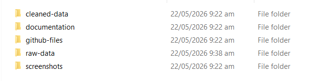
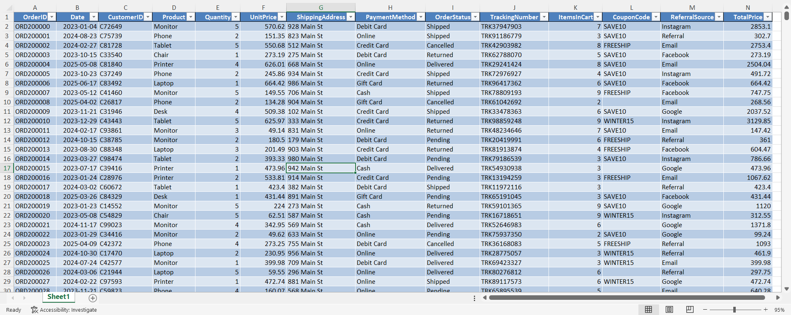
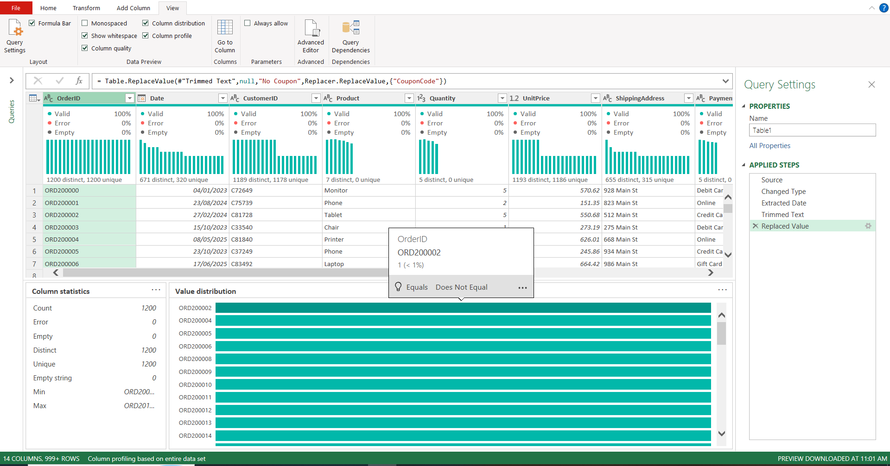
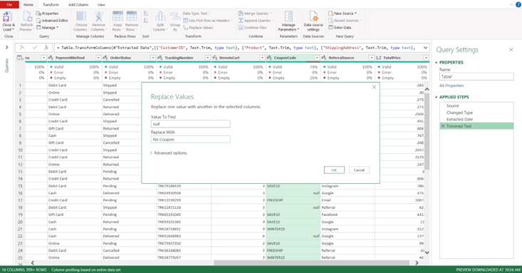
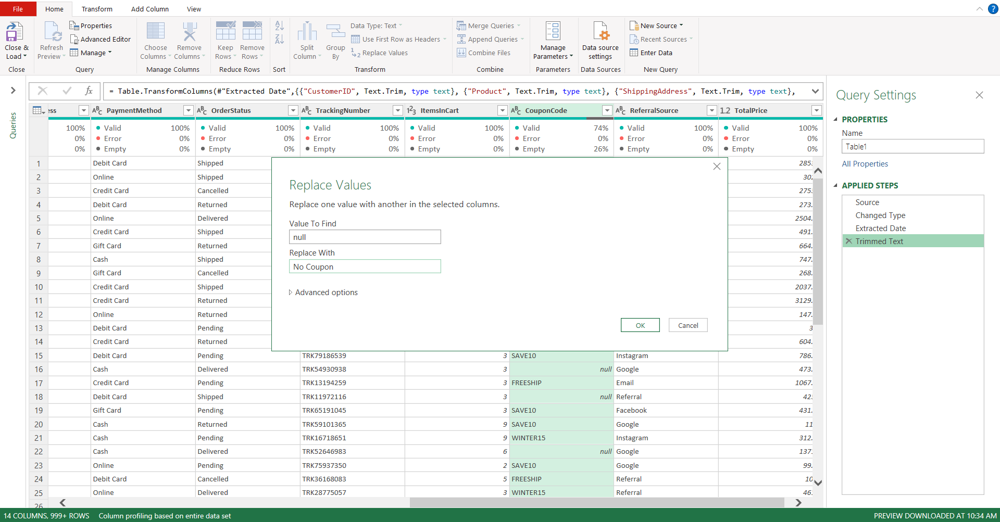
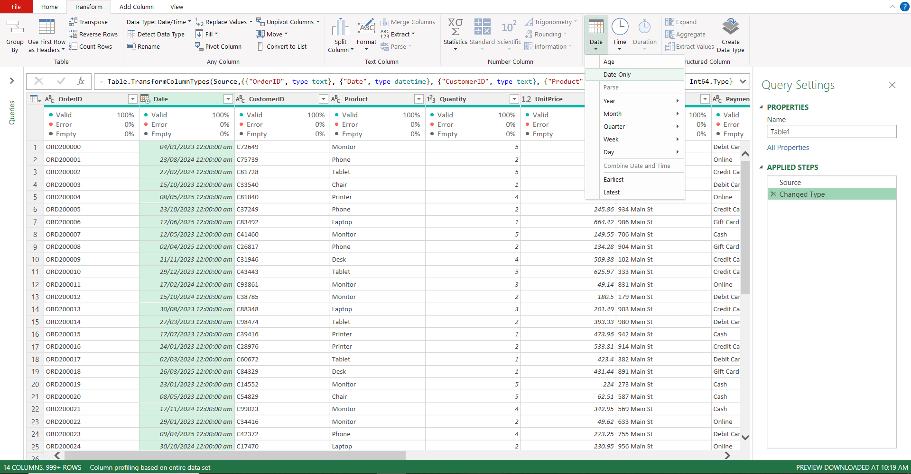
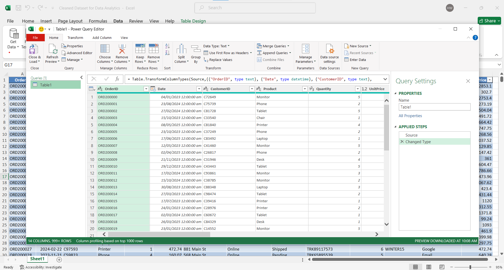
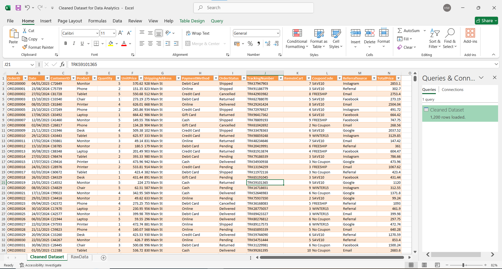

# Data Cleaning & Preparation Project

## Project Overview

This project focuses on cleaning and preparing a raw retail sales dataset for further analysis and reporting.

The primary objective was to improve data quality, ensure consistency, validate business-critical fields, and prepare the dataset for Exploratory Data Analysis (EDA), SQL analysis, and Power BI dashboard development.

---

## Project Objectives

* Assess overall data quality
* Identify and handle missing values
* Validate record uniqueness
* Standardize date formats
* Verify data types and data consistency
* Prepare a clean dataset for downstream analytics

---

## Tools Used

* Microsoft Excel
* Power Query
* GitHub

---

## Dataset Information

| Attribute        | Value                     |
| ---------------- | ------------------------- |
| Total Records    | 1,200                     |
| Total Columns    | 14                        |
| Unique Order IDs | 1,200                     |
| Dataset Type     | Retail Sales Transactions |

### Dataset Fields

* OrderID
* Date
* CustomerID
* Product
* Quantity
* UnitPrice
* PaymentMethod
* OrderStatus
* ItemsInCart
* CouponCode
* ReferralSource
* TotalPrice

---

## Project Workflow

### 1. Project Structure

The project was organized into separate folders for raw data, cleaned data, screenshots, and project documentation.

#### Screenshot

---

### 2. Raw Dataset Review

The original dataset was reviewed to understand its structure, columns, and overall quality before beginning the cleaning process.

#### Screenshot

---

### 3. Data Profiling

Data profiling was performed using Power Query to analyze:

* Data quality
* Data distribution
* Distinct values
* Empty values

#### Screenshot

---

### 4. Missing Value Analysis

The dataset was inspected for missing values.

Special attention was given to the CouponCode column to identify blank entries and verify their business impact.

#### Screenshot

---

### 5. Coupon Code Cleaning

Coupon code values were reviewed and standardized to improve consistency throughout the dataset.

#### Screenshot

---

### 6. Date Standardization

Date values were reviewed and standardized to ensure consistent formatting across all records.

#### Screenshot

---

### 7. Power Query Transformations

All cleaning and validation activities were performed using Microsoft Excel Power Query.

Transformations included:

* Data validation
* Format standardization
* Data quality checks
* Missing value review

#### Screenshot

---

### 8. Final Dataset Validation

After completing all cleaning activities, the dataset was validated to ensure it was ready for analysis and reporting.

#### Screenshot

---

## Validation Results

| Validation Check      | Status |
| --------------------- | ------ |
| Missing Values Review | Passed |
| Duplicate Validation  | Passed |
| Date Formatting       | Passed |
| Data Type Validation  | Passed |
| Data Consistency      | Passed |
| Final Quality Review  | Passed |

---

## Project Deliverables

* Cleaned_Dataset.xlsx
* Power Query Transformation Steps
* Data Validation Results
* Project Screenshots

---

## Key Outcomes

* Improved dataset quality and consistency
* Standardized date formats
* Verified unique transaction records
* Validated critical business fields
* Prepared the dataset for EDA, SQL analysis, and dashboard development

---

## Skills Demonstrated

### Data Cleaning

* Data Profiling
* Missing Value Handling
* Data Validation
* Data Quality Assessment

### Power Query

* Data Transformation
* Data Standardization
* Data Type Management

### Analytics Preparation

* Dataset Preparation
* Business Data Validation
* Reporting Readiness

---

# Author

## Muhammad Huzaifa Waheed

BS Computer Science Student

Data Analyst | Power BI Developer | QA Engineer

GitHub:
https://github.com/huzaifawaheed2

LinkedIn:
https://www.linkedin.com/in/muhammad-huzaifa-waheed-70043338b

---

If you found this project useful, consider giving it a star.
