# Exploratory Data Analysis (EDA) – Retail Sales Dataset

## Project Overview

This project focuses on performing Exploratory Data Analysis (EDA) on a retail sales dataset using Microsoft Excel, Power Query, Pivot Tables, and Pivot Charts.

The objective was to identify business trends, customer behavior patterns, revenue drivers, product performance, referral source effectiveness, and potential outliers within the dataset.

---

## Project Objectives

* Analyze customer purchasing behavior
* Perform descriptive statistical analysis
* Identify product performance trends
* Analyze revenue generation across products
* Evaluate payment method preferences
* Analyze referral source effectiveness
* Detect outliers using the IQR method
* Generate business insights from the dataset

---

## Tools Used

* Microsoft Excel
* Power Query
* Pivot Tables
* Pivot Charts
* GitHub

---

## Dataset Information

The dataset contains retail sales transaction records including:

* Order ID
* Product
* Quantity
* Unit Price
* Items In Cart
* Total Price
* Payment Method
* Order Status
* Referral Source
* Coupon Code
* Order Date

### Dataset Summary

| Metric           | Value |
| ---------------- | ----- |
| Total Records    | 1200  |
| Products         | 7     |
| Payment Methods  | 5     |
| Order Statuses   | 5     |
| Referral Sources | 5     |

---

## Data Preparation

The dataset was reviewed and validated before performing analysis.

### Raw Dataset Review

#### Screenshot

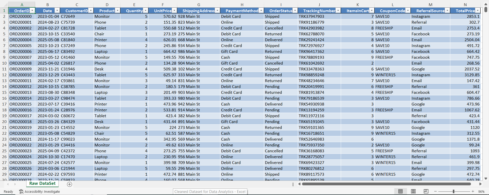

### Data Profiling

Data profiling was performed to evaluate:

* Data quality
* Data distribution
* Distinct values
* Missing values

#### Screenshot

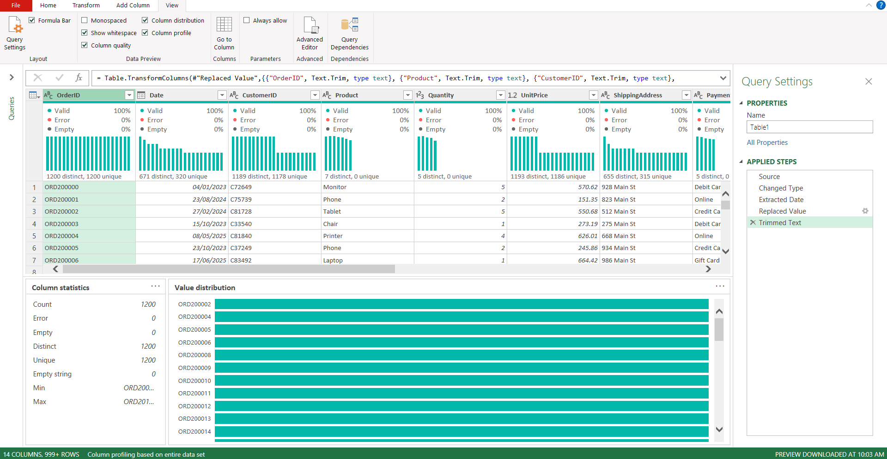

### Date Standardization

Date fields were reviewed and standardized for accurate trend analysis.

#### Screenshot

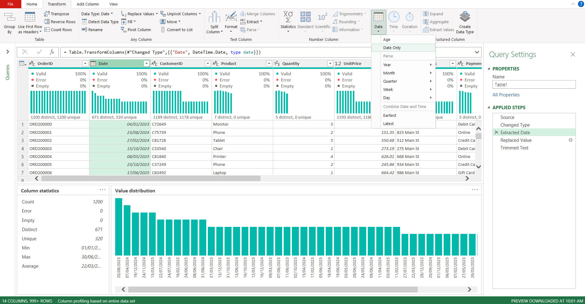

### Coupon Code Validation

Coupon code values were reviewed and standardized.

#### Screenshot

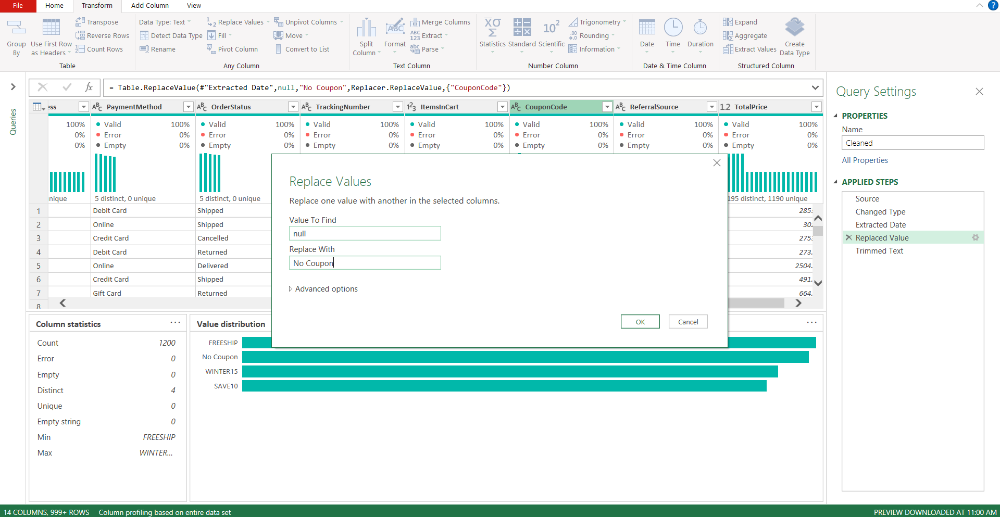

### Duplicate Validation

Order IDs were verified to ensure data integrity.

#### Screenshot

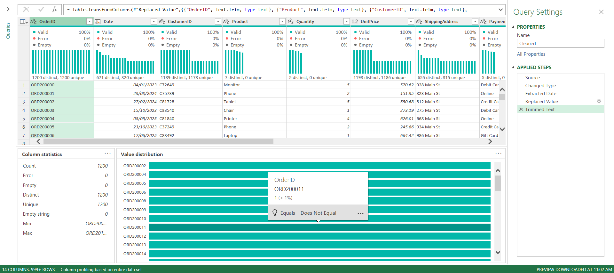

### Cleaned Dataset

The final validated dataset was prepared for analysis.

#### Screenshot

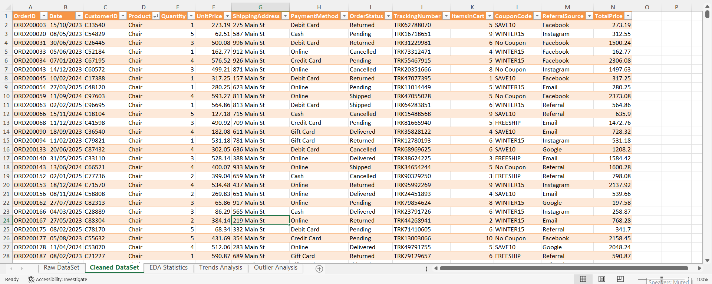

---

## Descriptive Statistics Analysis

Statistical analysis was performed using Excel.

The following measures were calculated:

* Count
* Mean
* Median
* Minimum
* Maximum

### Statistical Summary

| Variable      | Min   | Max     | Mean    | Median |
| ------------- | ----- | ------- | ------- | ------ |
| Quantity      | 1     | 5       | 2.95    | 3      |
| Unit Price    | 11.39 | 699.93  | 356.41  | 364.21 |
| Items In Cart | 1     | 10      | 5.49    | 5      |
| Total Price   | 11.39 | 3456.40 | 1053.97 | 823.62 |

#### Screenshot

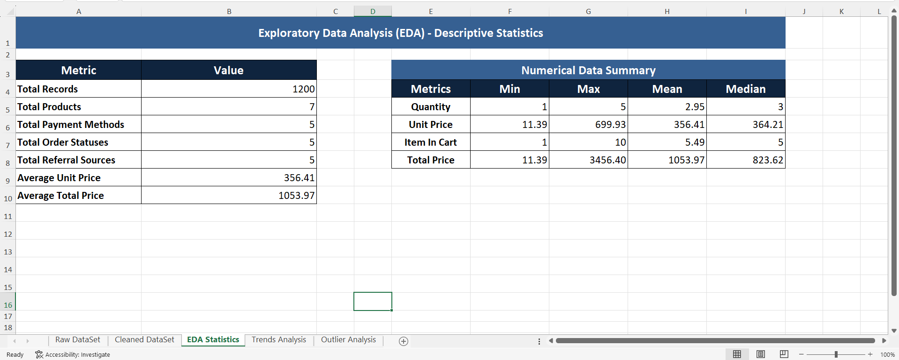

---

## Trend Analysis

### Revenue Trend Analysis

Revenue trends were analyzed to identify sales performance over time.

#### Screenshots

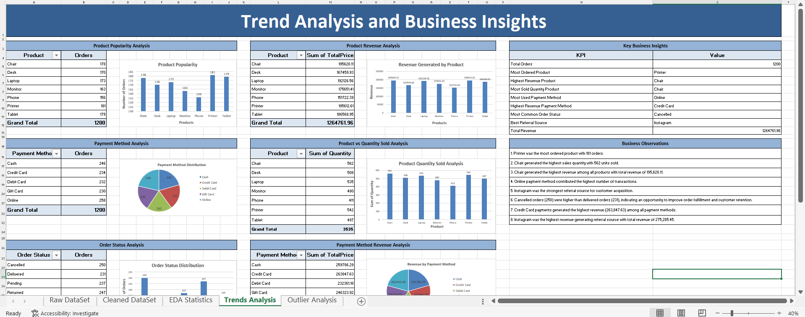

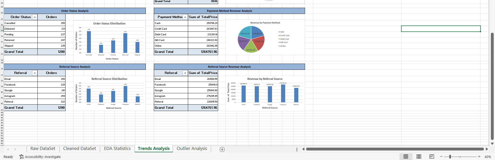

---

## Product Analysis

### Product Popularity Analysis

* Printer was the most ordered product.
* Total Orders: 181

#### Screenshot

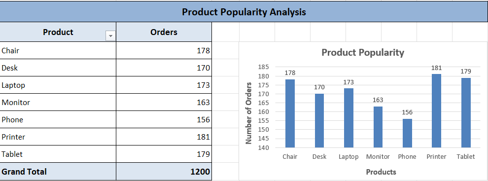

### Product Revenue Analysis

* Chair generated the highest revenue.
* Revenue: $195,620.11

#### Screenshot

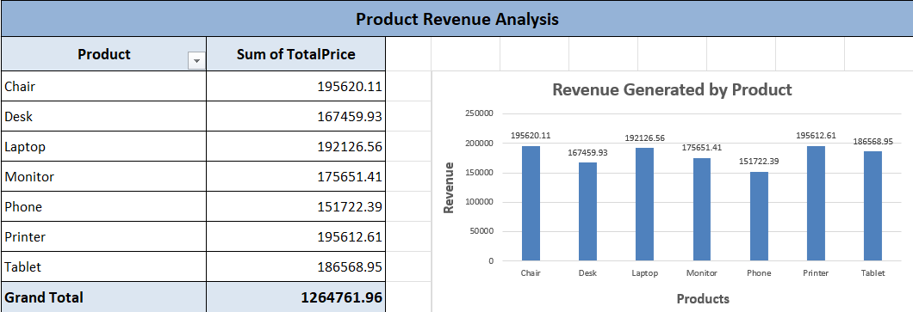

### Product Quantity Sold Analysis

* Chair recorded the highest sales quantity.
* Units Sold: 562

#### Screenshot

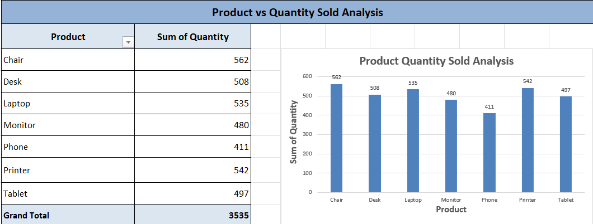

---

## Payment Method Analysis

### Transaction Analysis

Payment method usage was analyzed to understand customer preferences.

#### Screenshot

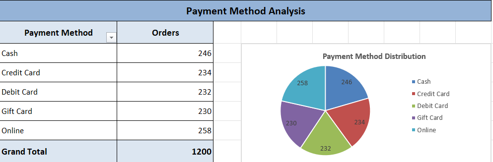

### Revenue Analysis

Revenue contribution was analyzed for each payment method.

#### Screenshot

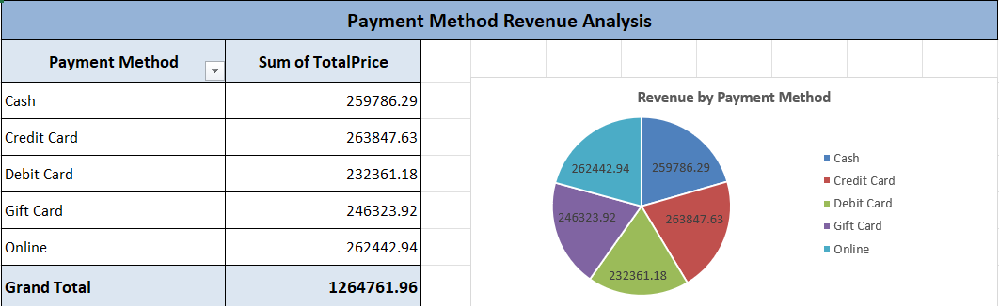

---

## Order Status Analysis

Order status distribution was analyzed to evaluate fulfillment performance.

#### Screenshot

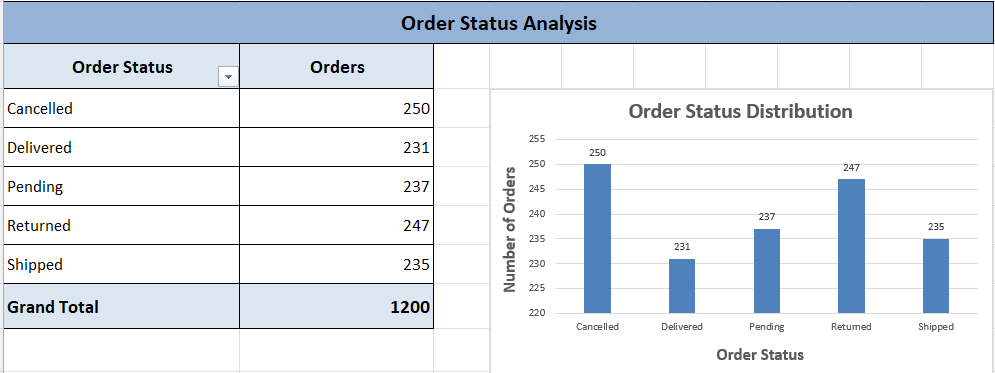

---

## Referral Source Analysis

### Referral Source Performance

Referral channels were analyzed to identify customer acquisition effectiveness.

#### Screenshot

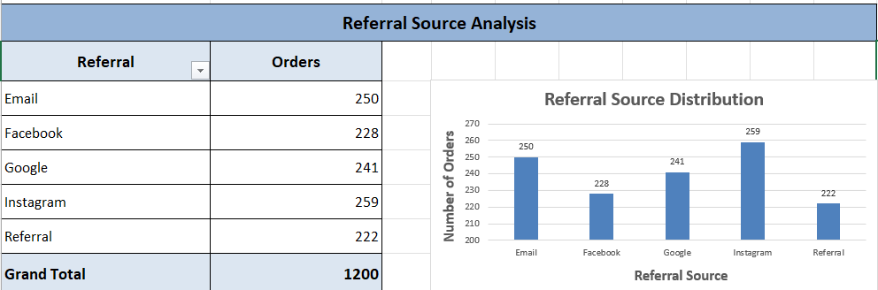

### Referral Revenue Analysis

Revenue generated through referral channels was evaluated.

#### Screenshot

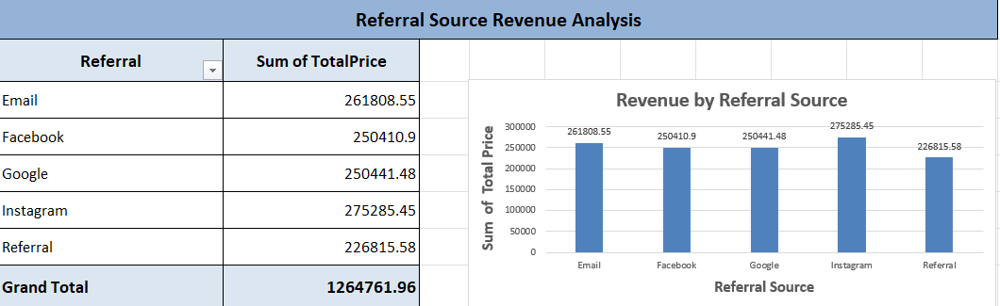

---

## Key Business Insights

### Business Insights Summary

#### Screenshot

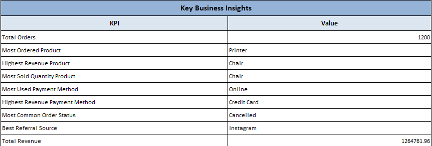

### Key Findings

1. Printer was the most ordered product with 181 orders.
2. Chair generated the highest revenue among all products.
3. Chair recorded the highest sales quantity.
4. Online payment method contributed the highest number of transactions.
5. Credit Card payments generated the highest revenue.
6. Instagram was the strongest referral source.
7. Instagram generated the highest referral revenue.
8. Cancelled orders slightly exceeded delivered orders.

#### Screenshot

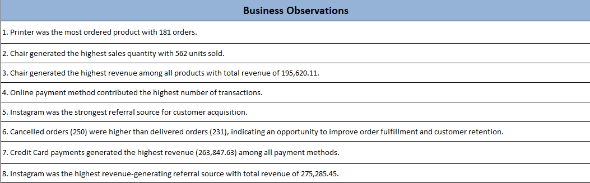

---

## Outlier Analysis

Outliers were detected using the Interquartile Range (IQR) method.

### Variables Analyzed

* Quantity
* UnitPrice
* ItemsInCart
* TotalPrice

#### Outlier Analysis Dashboard

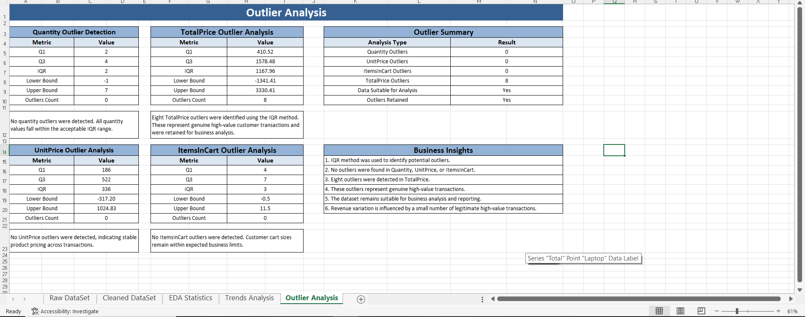

### Quantity Outlier Analysis

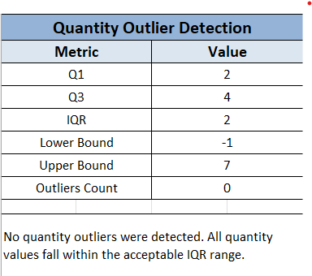

### Unit Price Outlier Analysis

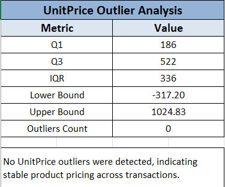

### Items In Cart Outlier Analysis

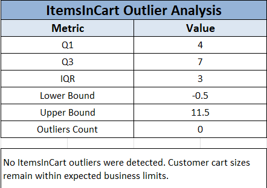

### Total Price Outlier Analysis

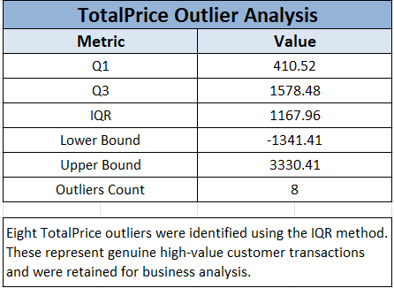

### Outlier Summary

| Variable    | Outliers |
| ----------- | -------- |
| Quantity    | 0        |
| UnitPrice   | 0        |
| ItemsInCart | 0        |
| TotalPrice  | 8        |

#### Screenshot

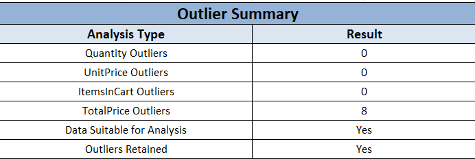

### Final Outlier Insights

#### Screenshot

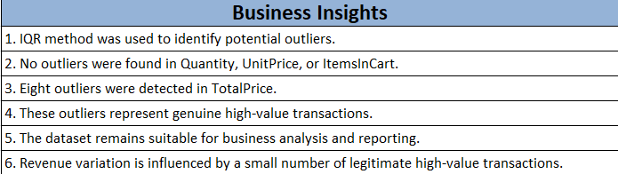

---

## Conclusion

The Exploratory Data Analysis successfully identified key business trends, customer behavior patterns, revenue drivers, and potential outliers within the dataset.

The analysis revealed that product performance, payment preferences, and referral channels significantly influence business outcomes. Outlier detection confirmed that the dataset is reliable and suitable for analytical reporting.

The insights generated from this project can support future business decisions related to sales performance, customer acquisition strategies, product management, and revenue optimization.

---

# Author

## Muhammad Huzaifa Waheed

BS Computer Science Student

Data Analyst | Power BI Developer | QA Engineer

GitHub:
https://github.com/huzaifawaheed2

LinkedIn:
https://www.linkedin.com/in/muhammad-huzaifa-waheed-70043338b

---

If you found this project useful, consider giving it a star.
