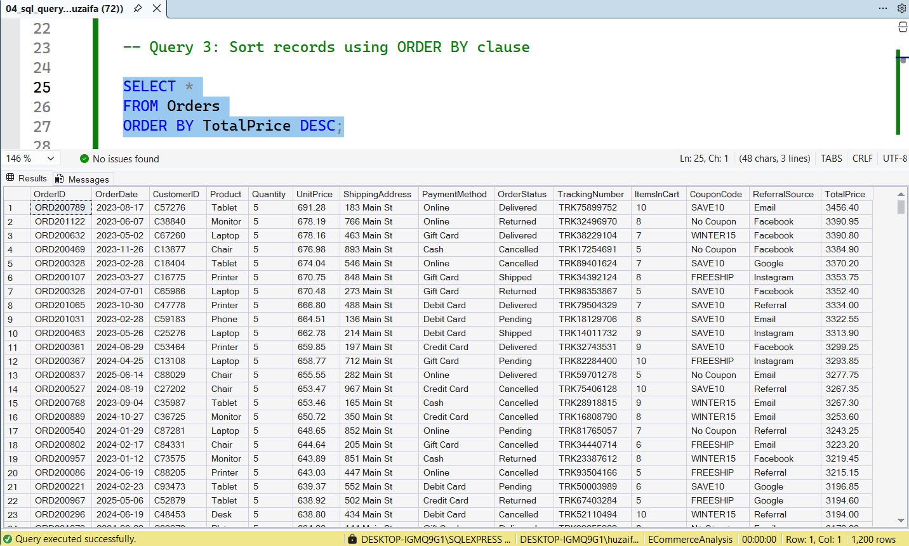
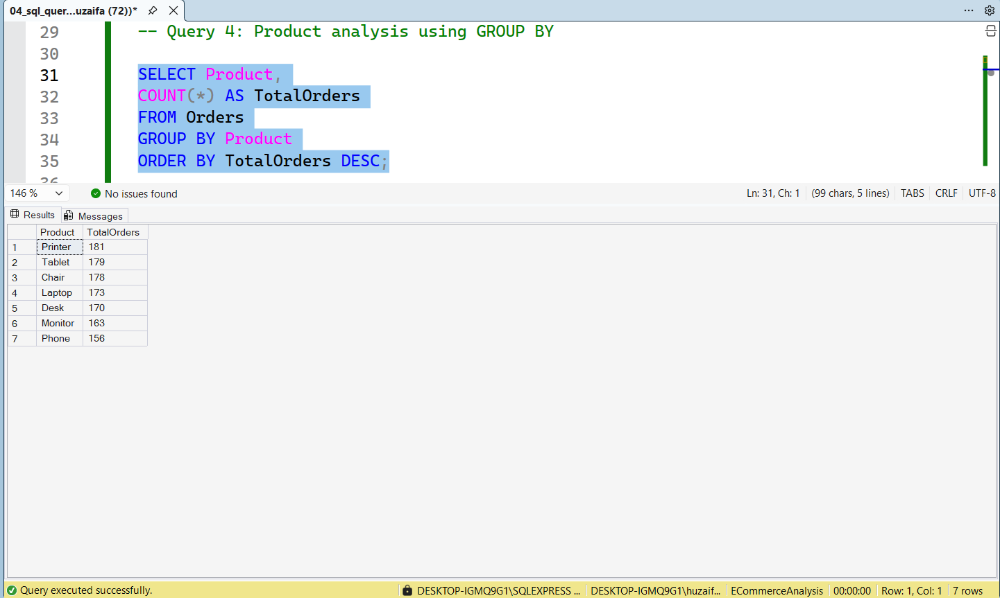
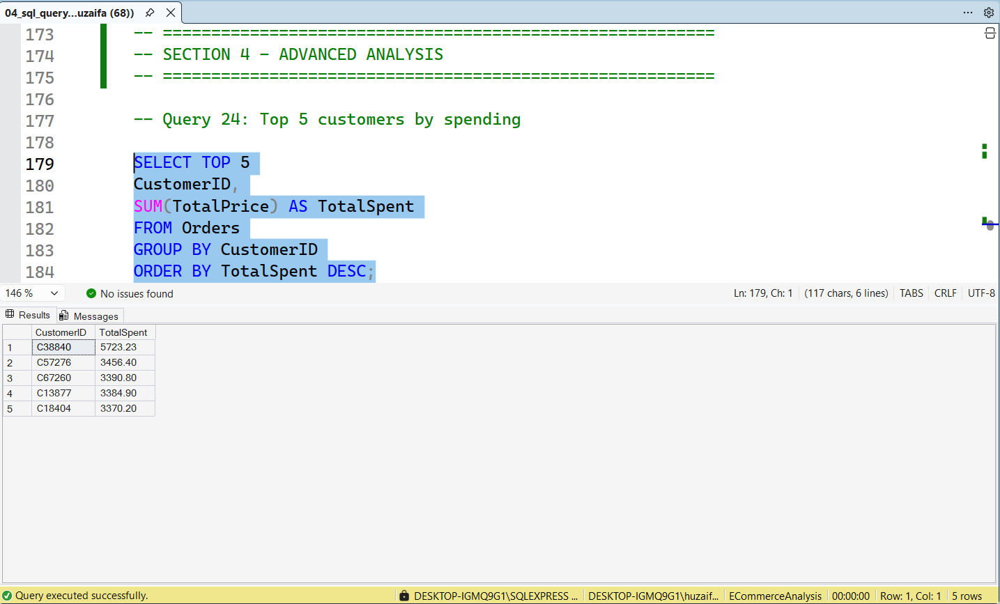
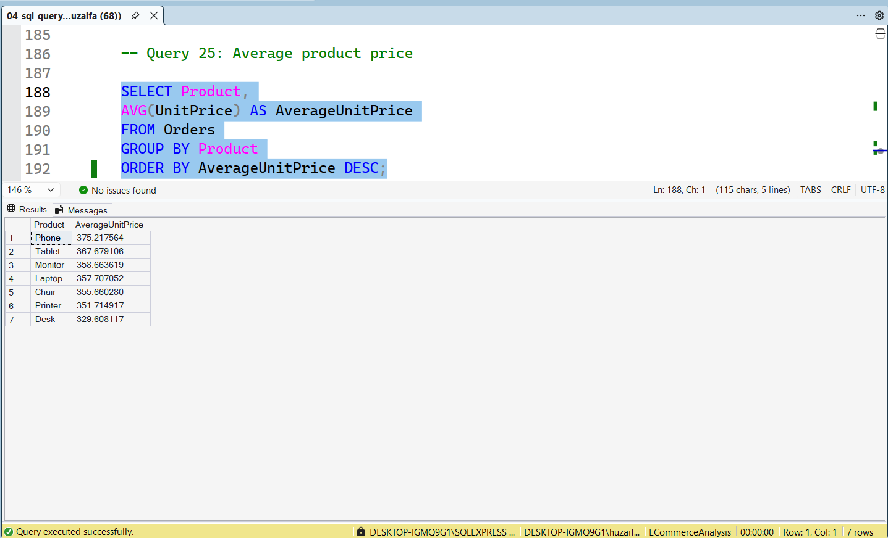

# SQL Data Analysis Project

## Project Overview

This project focuses on performing SQL-based analysis on a retail sales dataset using Microsoft SQL Server.

The objective was to transform raw transactional data into meaningful business insights through SQL queries, filtering techniques, aggregation functions, and business reporting. The project covers the complete workflow from database creation and data import to advanced analytical reporting and business intelligence.

---

## Project Objectives

* Create and manage a SQL database
* Import and validate transactional data
* Perform SQL-based data analysis
* Analyze customer purchasing behavior
* Evaluate product performance
* Measure revenue generation
* Analyze payment preferences
* Evaluate referral source effectiveness
* Generate business insights through SQL queries

---

## Tools Used

* Microsoft SQL Server
* Microsoft Excel
* GitHub

---

## Dataset Overview

The dataset contains retail sales transaction records including:

* Order ID
* Order Date
* Customer ID
* Product
* Quantity
* Unit Price
* Shipping Address
* Payment Method
* Order Status
* Tracking Number
* Items In Cart
* Coupon Code
* Referral Source
* Total Price

### Dataset Screenshot

<p align="center">
  
</p>

---

# Database Setup

## Database Creation

A dedicated SQL database was created for storing and analyzing retail sales transactions.

### SQL Command

```sql
CREATE DATABASE ECommerceAnalysis;
```

```sql
USE ECommerceAnalysis;
```

### Screenshot

<p align="center">
  
</p>

### Explanation

* A separate database environment was created for analysis.
* This ensured proper organization and management of transactional data.
* The database served as the foundation for all subsequent SQL operations.

---

## Table Creation

The Orders table was created with appropriate column names and data types.

### Screenshot

<p align="center">
  
</p>

### Explanation

* The table structure was designed to store transaction information efficiently.
* Appropriate data types were assigned to each field.
* Proper table design improves query performance and data integrity.

---

## Data Import Process

The dataset was imported from Excel into SQL Server using the Import and Export Wizard.

### Import Wizard

<p align="center">
  
</p>

### Data Type Mapping

<p align="center">
  
</p>

### Successful Import

<p align="center">
  
</p>

### Explanation

* Column mappings were verified.
* Data types were validated.
* Import errors were reviewed and resolved.
* The complete dataset was successfully imported into SQL Server.

---

## Data Migration and Validation

Date conversion issues were resolved through data migration and validation techniques.

### Orders Table

<p align="center">
  
</p>

### Data Migration

<p align="center">
  
</p>

### Final Orders Table

<p align="center">
  
</p>

### Data Verification

<p align="center">
  
</p>

### Explanation

* OrderDate conversion issues were resolved.
* Data was migrated into a corrected table structure.
* Validation confirmed successful migration without data loss.

---

# SQL Analysis

## Section 1: SQL Fundamentals

### Retrieve All Records

<p align="center">
  
</p>

#### Purpose

Retrieve all records from the Orders table.

#### Result Summary

* Confirmed successful data import.
* Verified table structure and available columns.

---

### WHERE Clause Filtering

<p align="center">
  
</p>

#### Purpose

Filter records based on specific conditions.

#### Result Summary

* Returned only records matching the defined criteria.
* Demonstrated data filtering techniques.

---

### ORDER BY Analysis

<p align="center">
  
</p>

#### Purpose

Sort transactions by TotalPrice in descending order.

#### Result Summary

* Identified highest-value transactions.
* Highlighted premium customer purchases.

---

### GROUP BY Product Analysis

<p align="center">
  
</p>

#### Purpose

Group records by product.

#### Result Summary

* Generated product-level summaries.
* Enabled comparison of product performance.

---

## Section 2: Aggregate Functions

### Total Orders

<p align="center">
  
</p>

#### Purpose

Count total transactions.

#### Result Summary

* Confirmed dataset size.
* Verified total order count.

---

### Total Revenue

<p align="center">
  
</p>

#### Purpose

Calculate total revenue generated.

#### Result Summary

* Provided an overall revenue figure.
* Measured business performance.

---

### Average Order Value

<p align="center">
  
</p>

#### Purpose

Calculate average order value.

#### Result Summary

* Measured average customer spending.
* Useful for sales performance evaluation.

---

## Section 3: Intermediate SQL Practice

### AND Operator

<p align="center">
  
</p>

#### Purpose

Apply multiple filtering conditions simultaneously.

#### Result Summary

* Returned records satisfying all conditions.

---

### OR Operator

<p align="center">
  
</p>

#### Purpose

Retrieve records matching either condition.

#### Result Summary

* Expanded result set based on multiple criteria.

---

### BETWEEN Operator

<p align="center">
  
</p>

#### Purpose

Filter values within a specified range.

#### Result Summary

* Retrieved transactions within selected limits.

---

### IN Operator

<p align="center">
  
</p>

#### Purpose

Filter records using multiple values.

#### Result Summary

* Simplified multi-value filtering.

---

### LIKE Operator

<p align="center">
  
</p>

#### Purpose

Search records using patterns.

#### Result Summary

* Retrieved matching text-based records.

---

### DISTINCT Payment Methods

<p align="center">
  
</p>

#### Purpose

Display unique payment methods.

#### Result Summary

* Identified all available payment channels.

---

### Minimum Order Value

<p align="center">
  
</p>

#### Purpose

Find lowest transaction value.

#### Result Summary

* Identified minimum order amount.

---

### Maximum Order Value

<p align="center">
  
</p>

#### Purpose

Find highest transaction value.

#### Result Summary

* Identified maximum order amount.

---

# Business Analysis

## Top Selling Products

<p align="center">
  
</p>

### Findings

* Chair recorded the highest sales volume with 562 units sold.
* Printer ranked second in total units sold.
* Product demand was concentrated among a few high-performing products.

### Business Impact

* Supports inventory planning.
* Helps prioritize top-performing products.

---

## Product Revenue Analysis

<p align="center">
  
</p>

### Findings

* Chair generated the highest revenue of 195,620.11.
* Revenue contribution varied significantly across products.

### Business Impact

* Helps identify profitable products.
* Supports pricing and revenue strategies.

---

## Payment Method Analysis

<p align="center">
  
</p>

### Findings

* Online Payment was the most frequently used payment method.

### Business Impact

* Highlights customer payment preferences.
* Supports payment optimization decisions.

---

## Payment Revenue Analysis

<p align="center">
  
</p>

### Findings

* Credit Card generated the highest revenue.

### Business Impact

* Useful for payment channel performance evaluation.

---

## Order Status Analysis

<p align="center">
  
</p>

### Findings

* Cancelled orders slightly exceeded delivered orders.

### Business Impact

* Indicates opportunities to improve order fulfillment processes.

---

## Referral Source Analysis

<p align="center">
  
</p>

### Findings

* Instagram generated the highest number of referred orders.

### Business Impact

* Demonstrates strong social media marketing performance.

---

## Referral Revenue Analysis

<p align="center">
  
</p>

### Findings

* Instagram generated the highest referral revenue.

### Business Impact

* Supports marketing budget allocation decisions.

---

## Top 10 Highest Value Orders

<p align="center">
  
</p>

### Findings

* High-value transactions contributed significantly to overall revenue.

### Business Impact

* Helps identify premium customer segments.

---

# Advanced Analysis

## Top 5 Customers by Spending

<p align="center">
  
</p>

### Findings

* Customer C38840 generated the highest spending.

### Business Impact

* Supports customer segmentation strategies.

---

## Average Product Price

<p align="center">
  
</p>

### Findings

* Significant pricing differences existed across products.

### Business Impact

* Useful for pricing strategy evaluation.

---

## Revenue by Year

<p align="center">
  
</p>

### Findings

| Year | Revenue    |
| ---- | ---------- |
| 2023 | 552,643.24 |
| 2024 | 480,235.87 |
| 2025 | 231,882.85 |

### Business Impact

* Reveals long-term revenue trends.
* Supports strategic planning and forecasting.

---

## Monthly Revenue Trend

<p align="center">
  
</p>

### Findings

* Monthly revenue fluctuated throughout the period.
* Some months outperformed others significantly.

### Business Impact

* Supports seasonal analysis and sales forecasting.

---

# Key Business Insights

1. Chair was the highest-selling product and highest revenue-generating product.
2. Online Payment was the most frequently used payment method.
3. Credit Card generated the highest payment-based revenue.
4. Instagram was the strongest referral source by both orders and revenue.
5. Customer C38840 generated the highest spending.
6. High-value transactions contributed significantly to total business revenue.
7. Revenue performance was strongest during 2023.

---

## Skills Demonstrated

### SQL

* SELECT
* WHERE
* ORDER BY
* GROUP BY
* HAVING
* COUNT
* SUM
* AVG
* MIN
* MAX
* DISTINCT
* BETWEEN
* IN
* LIKE

### Database Management

* Database Creation
* Data Import
* Data Migration
* Data Validation

### Business Analytics

* Product Analysis
* Revenue Analysis
* Customer Analysis
* Referral Analysis
* Performance Reporting

---

# Author

## Muhammad Huzaifa Waheed

BS Computer Science Student

Data Analyst | Power BI Developer | QA Engineer

GitHub:
https://github.com/huzaifawaheed2

LinkedIn:
https://www.linkedin.com/in/muhammad-huzaifa-waheed-70043338b

---

If you found this project useful, consider giving it a star.
