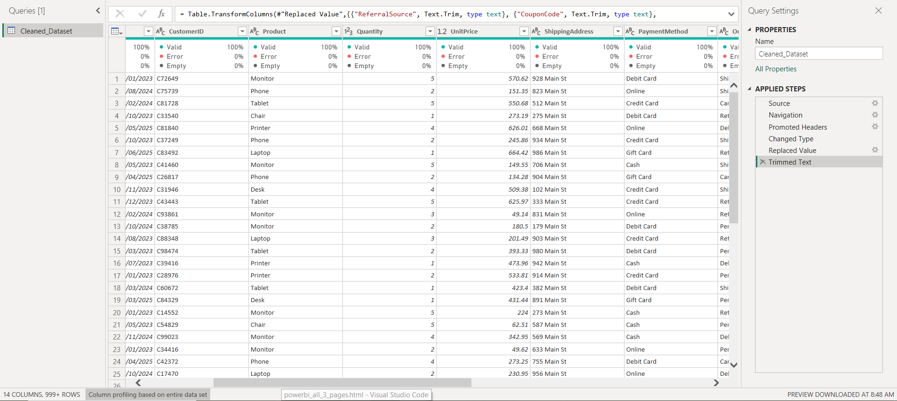
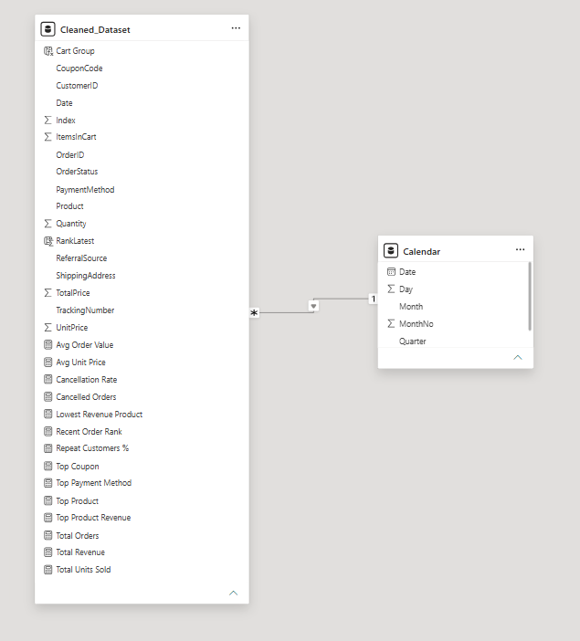
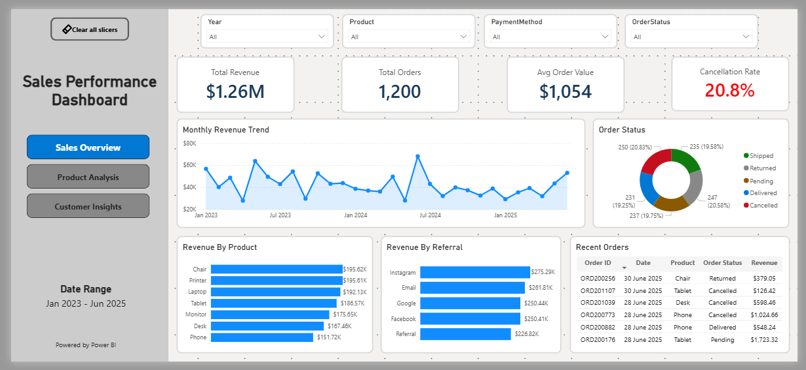
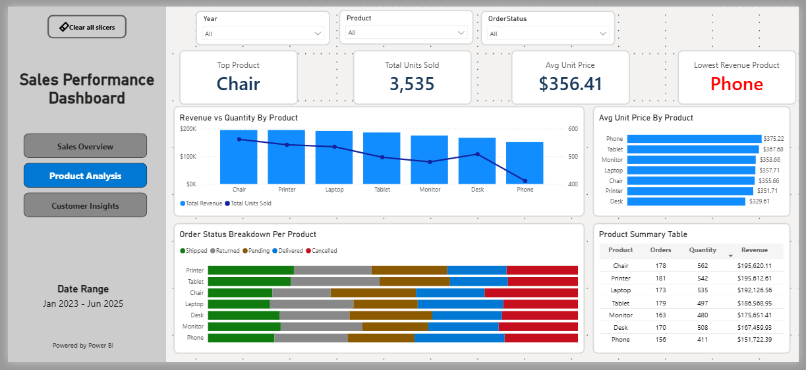
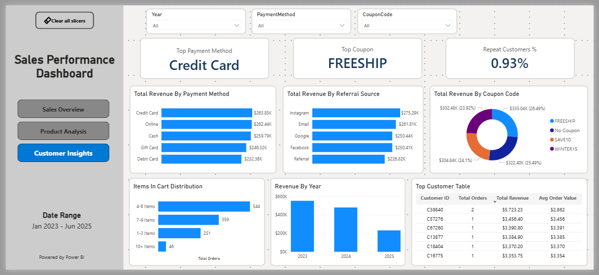
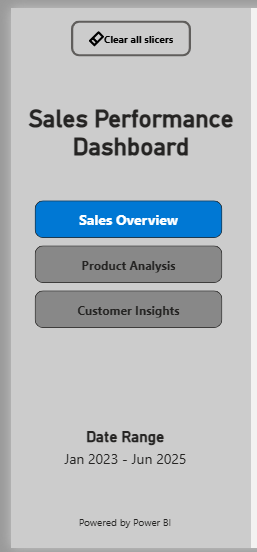

# Retail Sales Analytics Dashboard

A complete end-to-end **Power BI Data Visualization Project** built using Power Query, Data Modeling, DAX Measures, and Interactive Dashboard Design. This project transforms raw retail sales data into meaningful business insights through three interactive dashboard pages.

---

## Project Overview

This dashboard was developed to analyze retail sales performance, product trends, customer behavior, payment methods, coupon effectiveness, and revenue patterns.

The project follows the complete Data Analytics workflow:

```text
Raw Data
   ↓
Data Cleaning (Power Query)
   ↓
Data Modeling
   ↓
DAX Calculations
   ↓
Interactive Dashboards
   ↓
Business Insights
```

---

## Objectives

* Analyze overall sales performance
* Track revenue trends over time
* Identify top-performing products
* Monitor cancellation rates
* Analyze product-wise sales behavior
* Evaluate payment methods and coupon effectiveness
* Understand customer purchasing patterns
* Create a professional and interactive business dashboard

---

## Tools & Technologies Used

| Tool             | Purpose                        |
| ---------------- | ------------------------------ |
| Power BI Desktop | Dashboard Development          |
| Power Query      | Data Cleaning & Transformation |
| DAX              | KPI & Business Calculations    |
| Data Modeling    | Relationships & Analysis       |
| Excel / CSV      | Data Source                    |

---

## Dataset Information

The dataset contains retail sales transactions with information such as:

* Order ID
* Customer ID
* Date
* Product
* Quantity
* Unit Price
* Total Price
* Order Status
* Payment Method
* Coupon Code
* Referral Source
* Shipping Address
* Tracking Number

---

# Data Cleaning & Preparation

Data preprocessing was performed using Power Query.

### Cleaning Steps

* Removed unnecessary columns
* Checked missing values
* Corrected data types
* Standardized date fields
* Validated numeric fields
* Prepared data for modeling
* Created analytical structure for reporting

### Screenshot



---

# Data Modeling

A dedicated Calendar Table was created for time intelligence calculations.

### Calendar Table Fields

* Date
* Year
* Quarter
* Month
* Month Number
* Day

### Relationships

* Calendar Table → Sales Dataset
* One-to-Many Relationship
* Single Direction Filtering

### Screenshot



---

# Dashboard Pages

---

# 1. Sales Overview Dashboard

Provides a high-level summary of overall business performance.

## KPIs

* Total Revenue
* Total Orders
* Average Order Value
* Cancellation Rate

## Visuals

* Monthly Revenue Trend
* Revenue by Product
* Revenue by Referral Source
* Order Status Distribution
* Recent Orders Table

## Features

* Interactive Slicers
* Dynamic Filtering
* Cross Filtering
* Navigation Buttons
* Clear All Filters Button

### Screenshot



---

# 2. Product Analysis Dashboard

Focused on product performance and product-level insights.

## KPIs

* Top Product
* Total Units Sold
* Average Unit Price
* Lowest Revenue Product

## Visuals

* Revenue vs Quantity by Product
* Average Unit Price by Product
* Product Summary Table
* Order Status Breakdown per Product

## Business Insights

* Best-performing products
* Lowest-performing products
* Product pricing comparison
* Product revenue contribution

### Screenshot



---

# 3. Customer Insights Dashboard

Provides customer and purchasing behavior analysis.

## KPIs

* Top Payment Method
* Top Coupon
* Repeat Customer Percentage

## Visuals

* Revenue by Payment Method
* Revenue by Referral Source
* Revenue by Coupon Code
* Items in Cart Distribution
* Revenue by Year
* Top Customer Table

## Business Insights

* Most popular payment method
* Most effective coupon
* Customer retention rate
* Cart size behavior
* Referral channel effectiveness

### Screenshot



---

# Dashboard Navigation

A custom sidebar navigation system was developed to improve user experience.

### Navigation Features

* Sales Overview Page
* Product Analysis Page
* Customer Insights Page
* Active Page Highlighting
* Clear All Filters Button

### Screenshot



---

# DAX Measures Used

Key DAX measures implemented in this project include:

```DAX
Total Revenue
Total Orders
Total Units Sold
Avg Order Value
Avg Unit Price
Cancellation Rate
Cancelled Orders
Top Product
Top Product Revenue
Lowest Revenue Product
Top Coupon
Top Payment Method
Repeat Customers %
Recent Order Rank
```

---

# Key Business Insights

### Sales Performance

* Revenue exceeded $1.26M
* Average Order Value remained above $1,000
* Cancellation Rate was approximately 20.8%

### Product Insights

* Chair generated the highest revenue
* Phone generated the lowest revenue
* Product demand varied significantly across categories

### Customer Insights

* Credit Card was the most used payment method
* FREESHIP was the highest-performing coupon
* Customer repeat rate remained below 1%
* Referral channels contributed significantly to revenue generation

---

# Project Structure

```text
Project-4-Data-Visualization/
│
├── cleaned-data/
│   └── Cleaned Dataset for Data Analytics.xlsx
|
├── raw-data/
│   |── Dataset for Data Analytics.xlsx
|   └── Data Analytics Project 4.pdf
|
├── powerbi-dashboard/
│   └── Sales_Performance_Dashboard.pbix
│
├── screenshots/
│   ├── 01-data-cleaning-power-query.png
│   ├── 02-sales-overview-dashboard.png
│   ├── 03-product-analysis-dashboard.png
│   ├── 04-customer-insights-dashboard.png
│   ├── 05-navigation-menu.png
│   └── 06-data-model.png
│
└── README.md
```

---

# Skills Demonstrated

### Data Analytics

* Data Cleaning
* Data Transformation
* Data Modeling
* Business Intelligence
* KPI Design

### Power BI

* Power Query
* DAX
* Data Modeling
* Interactive Dashboards
* Navigation Design
* Custom Filtering

### Visualization

* KPI Cards
* Line Charts
* Bar Charts
* Donut Charts
* Combo Charts
* Analytical Tables

---

# Author

**Huzaifa Waheed**

Aspiring Data Analyst | Power BI Developer | Data Visualization Enthusiast

GitHub: https://github.com/huzaifawaheed2

---

## If you found this project useful, consider giving it a ⭐ on GitHub.
